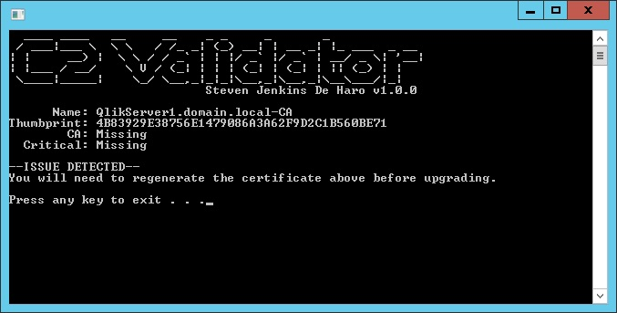

# C2 Validator (Certificate Constraint Validator)
Starting with Qlik Sense February 2020, the node.js component that has been updated in this release will now enforce certain security checks in a certificate's Basic Constraints. If a Qlik Sense installation existed before June 2019 at any time, then those needed constraints are not present nor are they added when upgrading since the Qlik Sense installer does not upgrade certificates. New installations that were installed with Qlik Sense June 2019 or later are not affected. C2 Validator is a one click solution to quickly determine if the current installation is affected by this change for situations where the IT team cannot remember what the initial installation version was or as a preventative measure when upgrading. More information can be found here [https://support.qlik.com/articles/000094782](https://support.qlik.com/articles/000094782).

Releases: [https://github.com/StevenJDH/C2-Validator/releases](https://github.com/StevenJDH/C2-Validator/releases)

## Features
* Checks to see if the internal Qlik Sense Root certificate needs to be regenerated.
* Displays the certificate name, thumbprint, and Basic Constraints required by Qlik Sense.
* **New** [Silent Mode](https://github.com/StevenJDH/C2-Validator/wiki/Silent-Mode) to included this tool as part of an automated script.

## Prerequisites
* Qlik Sense Enterprise server installed on Windows Server 2012 R2 or newer.

## Command line usage for Silent Mode
Below is the usage information that is needed to run the tool via the command line in Silent Mode as part of a script. You can still run the tool directly by double-clicking on the executable. See the wiki article [Silent Mode](https://github.com/StevenJDH/C2-Validator/wiki/Silent-Mode) for more information regarding the return codes used by the tool. 

    Usage: C2-Validator_vX.X.X.XXXXX.exe [-s | -?]

    Options:
      -s, -S         Runs the validator in silent mode for scripting.
      -?, -h, -H     Displays this usage information.

## Disclaimer
C2 Validator is distributed in the hope that it will be useful, but WITHOUT ANY WARRANTY; without even the implied warranty of MERCHANTABILITY or FITNESS FOR A PARTICULAR PURPOSE. See the GNU General Public License for more details.

## Do you have any questions?
Many commonly asked questions are answered in the FAQ:
[https://github.com/StevenJDH/C2-Validator/wiki/FAQ](https://github.com/StevenJDH/C2-Validator/wiki/FAQ)

## Need to contact me?
I can be reached here directly at [https://21.co/stevenjdh](https://21.co/stevenjdh "Contact Page")

## Want to show your support?

|Method       | Address                                                                                                    |
|------------:|:-----------------------------------------------------------------------------------------------------------|
|PayPal:      | [https://www.paypal.me/stevenjdh](https://www.paypal.me/stevenjdh "Steven's Paypal Page")                  |
|Bitcoin:     | 3GyeQvN6imXEHVcdwrZwKHLZNGdnXeDfw2                                                                         |
|Litecoin:    | MAJtR4ccdyUQtiiBpg9PwF2AZ6Xbk5ioLm                                                                         |
|Ethereum:    | 0xa62b53c1d49f9C481e20E5675fbffDab2Fcda82E                                                                 |
|Dash:        | Xw5bDL93fFNHe9FAGHV4hjoGfDpfwsqAAj                                                                         |
|Zcash:       | t1a2Kr3jFv8WksgPBcMZFwiYM8Hn5QCMAs5                                                                        |
|PIVX:        | DQq2qeny1TveZDcZFWwQVGdKchFGtzeieU                                                                         |
|Ripple:      | rLHzPsX6oXkzU2qL12kHCH8G8cnZv1rBJh Destination Tag: 2357564055                                        |
|Monero:      | 4GdoN7NCTi8a5gZug7PrwZNKjvHFmKeV11L6pNJPgj5QNEHsN6eeX3D &#8618;aAQFwZ1ufD4LYCZKArktt113W7QjWvQ7CWDXrwM8yCGgEdhV3Wt|

// Steven Jenkins De Haro ("StevenJDH" on GitHub)
